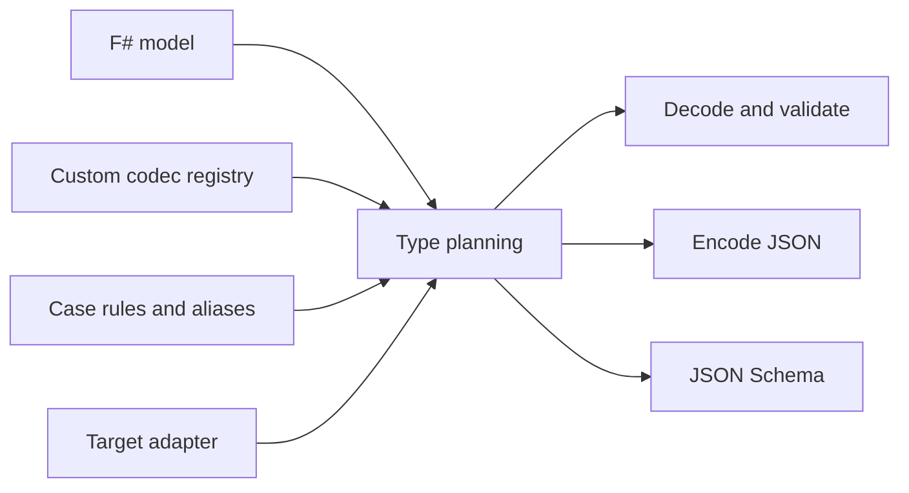

# Overview

[README](../README.md) · [Getting started →](getting-started.md)

Fable.TypedJson turns F# models into JSON codecs. A codec knows how to read a
backend-native JSON value into an F# value and how to write that value as JSON
text. The same planning logic describes the model as JSON Schema.

Use it when records and supported unions describe your data, and validation
rules should travel with the types used by those models.

## How the pieces fit together

| Concept | Responsibility |
| --- | --- |
| Model | Your F# records, collections, scalar types, and supported unions |
| `TypedJson<'T>` | A reusable codec for the whole model, with naming configuration |
| `IJsonCodec<'T>` | A per-type codec with decode, encode, and schema members |
| `CodecRegistry` | Explicitly associates types with their custom codecs |
| Target adapter | Supplies parsing, serialization, and native JSON operations |
| JSON Schema | Describes the wire shape and declarative constraints |

These are two different codec levels. Usually you derive a `TypedJson<'T>` for
a record. When a field needs its own rules or representation, define an
`IJsonCodec<'Field>` and put it in the registry before deriving the record codec.
The registry is immutable and belongs to your application; registration has no
global side effects.

## The normal workflow

1. Install the core and one target adapter.
2. Define the F# model and any custom field types.
3. Register the custom field codecs, if needed.
4. Construct a codec with `auto`, `autoWith`, `autoStrict`, or `autoStrictWith`.
5. Configure naming and model validation, then retain the finished codec.
6. Decode incoming data, encode outgoing values, and generate schema as needed.

`auto` uses an empty registry and accepts primitive coercion. `autoWith` adds
your registry. The `autoStrict` variants require matching JSON primitive types.
All four have the same default camelCase field names.

## Choose an input path

| Input | Entry point | Result |
| --- | --- | --- |
| JSON text | `decodeText codec text` | Value, malformed-text error, or validation errors |
| Parsed JSON | `codec.decode value` | Value or validation errors |
| String-valued fields | `codec.decodeStringMap fields` | Value or validation errors, with string parsing |

Encoding through `codec.encode` returns JSON **text**. The `dump` shortcuts
produce native JSON values with default naming. Schema generation has its own
entry points and needs the same registry used to construct the codec.

## What validation guarantees

Records collect errors across fields. Collections stop at their first failing
element. Errors carry paths so callers can identify the affected field or index.
Optional record fields accept missing values and JSON null as `None`; encoding
omits absent optional fields.

Constraints composed with `Codec.gt`, `Codec.minLength`, and similar helpers
also contribute schema keywords. Arbitrary F# validation functions do not
automatically become JSON Schema constraints. Encoding does not rerun decoding
validators; construct valid application values before encoding them.

## Reading path

Start with [Getting started](getting-started.md), then read
[Decoding](decoding.md) and [Validation](validation.md). Use
[Wire format](wire-format.md) when matching an external API and
[JSON Schema](json-schema.md) when describing that API or an LLM tool.

[Architecture](architecture.md) and [Performance](performance.md) explain the
implementation and codec lifecycle. [Choosing a JSON library](comparison.md)
helps assess the fit, and [Contributing](../CONTRIBUTING.md) covers repository work.
